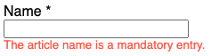

# Cross Language Validation (CLV) Schema - V0.11
This JSON schema specifies validation rules in a language independent manner to enable cross language validation.

An online, interactive JSON Schema validator for this schema can be found here:
https://www.jsonschemavalidator.net/s/6x2WkouR

Note: Neither JSON Schema nor JSON itself have per se means to enforce uniqueness of keys. Enforcement of uniqueness 
should be done either by the writer or the reader.

## Table of Contents
- [TL;DR](#tldr)
- [Motivation](#motivation)
  - [Drawbacks of existing validation frameworks](#drawbacks-of-existing-validation-frameworks)
  - [Required features of a flexible and expressive validation framework](#required-features-of-a-flexible-and-expressive-validation-framework)
- [Close-to-life example](#close-to-life-example)
  - [Example entities](#example-entities)
  - [Example validation rules](#example-validation-rules)
- [Documentation ](#documentation-)
  - [Validation Rule Types](#validation-rule-types)
    - [Content Rules](#content-rules)
    - [Update Rules](#update-rules)
    - [Mandatory Rules](#mandatory-rules)
    - [Immutable Rules](#immutable-rules)
  - [JSON structure](#json-structure)
  - [Entity Type related validation rules](#entity-type-related-validation-rules)
  - [Property related validation rules](#property-related-validation-rules)
    - [The key of the pair](#the-key-of-the-pair)
      - [Names of simple properties](#names-of-simple-properties)
      - [Names of nested properties](#names-of-nested-properties)
      - [Names with array index definitions](#names-with-array-index-definitions)
      - [Names with terminal aggregate function](#names-with-terminal-aggregate-function)
    - [The value of the pair](#the-value-of-the-pair)
  - [Condition types and objects](#condition-types-and-objects)
    - [Content constraint](#content-constraint)
    - [Permissions constraint](#permissions-constraint)
    - [Conditions constraint](#conditions-constraint)
      - [Single condition](#single-condition)
      - [Conditions Group](#conditions-group)
      - [Conditions Top Group](#conditions-top-group)
    - [Error code control](#error-code-control)
  - [Elementary constraints](#elementary-constraints)
    - [EQUALS\_ANY](#equals_any)
    - [EQUALS\_ANY\_REF](#equals_any_ref)
    - [EQUALS\_NONE](#equals_none)
    - [EQUALS\_NONE\_REF](#equals_none_ref)
    - [EQUALS\_NULL](#equals_null)
    - [EQUALS\_NOT\_NULL](#equals_not_null)
    - [REGEX\_ANY](#regex_any)
    - [REGEX\_NONE](#regex_none)
    - [SIZE](#size)
    - [RANGE](#range)
    - [FUTURE\_DAYS](#future_days)
    - [PAST\_DAYS](#past_days)
    - [PERIOD\_DAYS](#period_days)
    - [WEEKDAY\_ANY](#weekday_any)
    - [QUARTER\_ANY](#quarter_any)
    - [QUARTER\_ANY\_REF](#quarter_any_ref)
    - [YEAR\_ANY](#year_any)
    - [YEAR\_ANY\_REF](#year_any_ref)
    - [VALUE_CHANGED](#value_changed)
    - [VALUE_UNCHANGED](#value_unchanged)
- [Requirements for an implementer](#requirements-for-an-implementer)
  - [JSON producer](#json-producer)
  - [JSON consumer](#json-consumer)
  - [Validator](#validator)
    - [Validation error codes](#validation-error-codes)
    - [Rule validation sequence](#rule-validation-sequence)
- [Known implementations](#known-implementations)
- [Thoughts about possible extensions](#thoughts-about-possible-extensions)

# TL;DR
The purpose of this _JSON Schema_ is to describe _a wide range of validation rules_, independent of a specific 
programming language. The resulting JSON documents are intended to be used in applications that involve multiple 
components possibly written in different programming languages where the rules have to be validated in several 
components. E.g. in a frontend written in ES6 and a backend written in Java.

One objective is to apply the &#10169; [DRY principle](https://en.wikipedia.org/wiki/Don%27t_repeat_yourself) even for 
validation rules, according to the motto "define once, validate everywhere".

Of course this requires the implementation of generic _validators_ as well as the implementation of JSON _producers_ 
resp. JSON _consumers_ for valid JSON documents in the programming languages that are involved.

As an example of what is possible, we assume we have this quite complex validation rule that involves conditions that 
are logically linked by AND and OR:
> The _animalUse_ property of an article must not be changed if<br>
> a) it is assigned to a medical set<br>
> OR<br>
> b) it has been used once for animals - i.e. the _everLeftWarehouse_ AND _animalUse_ properties are both _true_.

With the &#10169; [CLV Java implementation](https://github.com/stephan-double-u/cross-language-validation-java) 
for this schema this validation rule can be defined like this: 
```java
public class AnyClass {
    static final ValidationRules<Article> article_rules = new ValidationRules<>(Article.class);
    static {
      article_rules.immutable("animalUse",
            ConditionsTopGroup.OR(
                    ConditionsGroup.AND(
                            Condition.of("medicalSetId", Equals.notNull())),
                    ConditionsGroup.AND(
                            Condition.of("animalUse", Equals.any(TRUE)),
                            Condition.of("everLeftWarehouse", Equals.any(TRUE)))));
    }
}
```
This Java implementation is a _JSON provider_, i.e. it provides a method to serialize the validation rules to JSON.
An application that uses this Java implementation can expose the JSON e.g. via a REST endpoint, e.g.:
```java
@GetMapping(value = "/validation-rules", produces = "application/json;charset=UTF-8")
public String getValidationRules(){
    return ValidationRules.serializeToJson(article_rules);
}
```
The JSON for the example rule would look similar to this: [JsonAnimalUse.md](subpages/JsonAnimalUse.md)


A frontend can then retrieve the serialized validation rules and make it known to the &#10169;
[CLV ECMAScript 6 implementation](https://github.com/stephan-double-u/cross-language-validation-es6) 
like this: 
```javascript
const getValidationRules = async () => {
    const response = await fetch('http://localhost:8080/validation-rules');
    const rules = await response.json();
    setValidationRules(rules);
}
```
Then it can e.g. check if an entity property is immutable and should be displayed as _disabled_ like this:
```javascript
// retrieved e.g. via GET /articles/12345
article = {
  "id": 12345,
  "animalUse": "true",
  "everLeftWarehouse": "true",
  "medicalSetId": "S-123-456"
  // other properties omitted
}
animalUseCheckbox.disabled = isPropertyImmutable("article", "animalUse", article);
```

&#9658; See the &#10169; [CLV Demo App](https://github.com/stephan-double-u/cross-language-validation-demo) as a 
comprehensive example of how to use the framework. It's also a good starting point to see how to write different 
types of rules.

# Motivation
Validation of input data plays a crucial role in almost any application. Whereby the server-side validation is a must, 
because the server should never trust the client-side. Of course client side validation is also important for a good 
user experience.

The idea for this JSON schema was inspired by a web application that had _many_ non-trivial validation rules involving 
user permissions and multi-property validations.
The front-end of this application was written in JavaScript, while the back-end was written in Java. 
Most of these validation rules should be utilized also on the client-side.
On the one hand to provide good user guidance, on the other hand to avoid numerous client-server round trips.

## Drawbacks of existing validation frameworks
At least for Java based apps the Java Bean Validation framework is the de-facto standard for validation, but it has 
some shortcomings:
- Most importantly: the validation rules can't be _reused_ easily in other components, and have to be re-implemented.
- The functionality of some standard annotations are quite limited. E.g. with `@Future` it is not possible to validate 
  that a date is 2 days in the future.
- Multi-property validations cannot be expressed in a concise form.
- Rules that dependent on user permissions cannot be expressed in a concise form.
- The rules for one class resp. entity are usually scattered over several code places.
- Class validators can not be used with Records.
- And a perhaps more philosophical aspect: Because of the annotation approach, real POJOs can not be validated.

## Required features of a flexible and expressive validation framework
It should be possible to define validation rules 
- for hierarchical (a.k.a. _nested_) properties
- that involve conditions for any number of properties (a.k.a. _multi-property validation_)
- that allow to combine these conditions with logical AND resp. OR
- for arrays resp. list properties it should be possible to refer to individual array resp. list elements
- that may depend on individual user permissions

# Close-to-life example
The example validation rules in this documentation are based loosely on this _close-to-life example_ to make the 
exemplary rules more descriptive.<br>
> Let's say we work for a company that rents _medical equipment_.<br>
> Each medical _article_ may contain several _accessories_.<br>
> Articles are grouped in _medical sets_.<br>
> The equipment is stored in warehouses and delivered to customers locations, e.g. hospital or animal clinics.<br>
> Staff members schedule _reservations_ on behalf of their customers.

## Example entities
These are example entities for the aforementioned entity types with some of their properties. The more technical 
properties like _id_, _createdBy_ etc. are omitted:

- Accessory
```json
{
  "name": "Biopsy Forcep",
  "amount": 1
}
```
- Article
```json
{
  "name": "Diagnostic Video Colonoscope",
  "number": "DVC-H123T/Z",
  "status": "ACTIVE",
  "animalUse": "true",
  "everLeftWarehouse": "false",
  "medicalSetId": null,
  "maintenanceNextDate": null,
  "responsibleUser": null,
  "accessories": [
  ]
}
```
- MedicalSet
```json
{
  "name": "Endoscope set advanced",
  "number": "ESA-1",
  "status": "COMMISSIONING",
  "animalUse": "true",
  "articles": [
  ]
}
```
- Reservation with customer
```json
{
  "status": "PREPARATION",
  "startDate": "2021-02-01",
  "endDate": "20121-02-28",
  "customer": {
    "name": "Estetical Pet Clinic",
    "status": "GOLD",
    "address": {
      "city": "New York City",
      "zipCode": "10001"
    }
  },
  "medicalSets": [
  ]
}
```

## Example validation rules
A fictitious requirements document could mention validation rules like this:
1. If an article is delivered for the first time, it has to be flagged as such (property _everLeftWarehouse_).
   - This flag must never be reset.
2. The _animalUse_ property of an article must not be changed if
   - it is assigned to a medical set, or
   - it has been used once for animals (i.e. the _everLeftWarehouse_ and _animalUse_ flags have been set).
3. Only managers are allowed to set customer level to PLATINUM.
4. Allowed article status transitions are:
   - NEW -> ACTIVE
   - NEW -> INACTIVE
   - ACTIVE -> INACTIVE
   - INACTIVE -> ACTIVE
   - ACTIVE -> DECOMMISSIONED.
   - INACTIVE -> DECOMMISSIONED.
6. An article must have a responsible user if the article status is not NEW, and the article is not assigned to a 
   MedicalSet.
7. The reservation start date must be 3 days in the future.
8. The reservation end date must be after the start date.
9. A reservation not in status PREPARATION must contain 1 to 3 medical sets. If the customer has status PLATINUM, it may
   contain up to 5 medical sets.

# Documentation 
## Validation Rule Types
It has been shown that it is appropriate to distinguish four types of rules, which differ in their semantics and
in the way they are evaluated.<br>
All validation rules (regardless of their type) have one thing in common: they specify (implicit or explicit)
_constraints_ on the allowed values of object properties.<br>
These _property constraints_ can specify the allowed values either _directly_ or _indirectly_.
Directly by specifying fixed values resp. value ranges, indirectly by referring to other object properties
whose values define the allowed values resp. value ranges.
> Example constraint with _fixed values_:<br>
> "The property _maintenanceNextDate_ must contain a date value which year **equals the year 2022**."

> Example constraint with _referenced values_:<br>
> "The property _maintenanceNextDate_ must contain a date value which year **equals the value of the property _year_**."

TODO: improve rule type documentation

### Content Rules
Defining a _content rule_ for a property means setting a constraint on the possible values of that property.

In a backend service the validation of such rules is usually done when an entity is **created or updated**.

In a frontend _content rules_ are usually validated _before_ the entity is sent to the backend.

Validation rules can depend on conditions about other object properties.

> Example rule: "The property _name_ must be at least 10 characters long, but only if the property _status_ is not
_NEW_".

Since _content rules_ (like _mandatory rules_) should also be validated when the entity is _created_, these conditions
_evaluated against the entity that should be created resp. updated_.

<table>
 <tr>
  <td><i>Example create resp. update entity</i></td>
 </tr>
 <tr>
  <td><pre>{
  "name": "Shorty",
  "status": "ACTIVE"
}</pre>
  </td>
 </tr>
</table>

> To stay with our example: if the user sets _status_ to e.g. _ACTIVE_ before pressing a _create_ button, it is
> evaluated if a _name_ with at least 10 characters has been entered as well.

### Update Rules
Like _content rules_, an _update rule_ for a property also sets a constraint on the possible values of that property.

In contrast to _content rules_ and similar to _immutable rules_, an _update rule_ is validated **only** when the entity
is **updated**. That means, that any conditions about other object properties the rule contains, are _evaluated
against the last stored object version_, a.k.a. the _current entity_.

That is, _update rules_ can be used to define _state transition validations_!

> Example rule: "The _status_ can be updated from _ACTIVE_ resp. _INACTIVE_ to _ACTIVE_, _INACTIVE_ or
> _DECOMMISSIONED_".

<table>
 <tr>
  <td><i>Example update instance</i></td>
  <td><i>Example current instance</i></td>
 </tr>
 <tr>
  <td><pre>{
  "status": "DECOMMISSIONED"
}</pre>
  </td>
  <td><pre>{
  "status": "INACTIVE"
}</pre>
  </td>
 </tr>
</table>

> Evaluation of the example rule: given an object that has been saved with _status_ _INACTIVE_.
> If the user has set _status_ to, say, _DECOMMISSIONED_, it is first evaluated whether the last stored
> _status_ is either _ACTIVE_ or _INACTIVE_ and then whether the edited value is _ACTIVE_, _INACTIVE_ or
> _DECOMMISSIONED_.

### Mandatory Rules
Defining a property as _mandatory_ simply says that the value of that property _must not be null_ when the
entity resp. its property gets validated.

In a backend service the validation of such rules is usually done when an entity is **created and updated**.

In a frontend the rule about a mandatory property can be used in 2 ways:
- decorate the corresponding form input field with a visual indicator
- validate it _before_ the entity is sent to the backend
  and to display an error message at the form input field when the rule is violated.

> E.g. the &#10169; [CLV Demo App](https://github.com/stephan-double-u/cross-language-validation-demo)
> displays the input field for the mandatory property _name_ together with the corresponding error message like this:
>
> 

Validation rules can depend on conditions about other object properties.
> Example rule: "The property _name_ should be mandatory, but only if the property _status_ is not _NEW_".

Since _mandatory rules_ should also be validated when the entity is _created_, these conditions
must be _evaluated against the entity that should be created resp. updated_.

<table>
 <tr>
  <td>Example <i>create resp. update entity</i></td>
 </tr>
 <tr>
  <td><pre>{
  "name": null,
  "status": "ACTIVE"
}</pre>
  </td>
 </tr>
</table>

> To stay with our example: only if the user has set the _status_ to something different than _NEW_ (e.g. _ACTIVE_),
> it is evaluated if a _name_ has been entered as well.

### Immutable Rules
Defining a property as _immutable_ (a.k.a. _read-only_) says that the value of that property _must not be changed_.

In a backend service the validation of such rules is usually done when an entity is **updated**. Determining if a
property value has changed is done by _comparing the (possibly) edited property value with the last stored value_.

In a frontend the rule about an immutable property can be used to display the form input field as disabled.

> E.g. the &#10169; [CLV Demo App](https://github.com/stephan-double-u/cross-language-validation-demo) displays the
> input field for the immutable property _status_ if the value is DECOMMISSIONED like this:
>
> 

Validation rules can depend on conditions about other object properties or about the same object property itself.

> Example rule: "The property _status_ must not be changed anymore if _status_ has been set to _DECOMMISSIONED_
before".

Since _immutable rules_ can only be validated when the entity is **updated**, two entities exist against which
the rule could be evaluated: the _update entity_ (e.g. the entity send by a PUT request) and the _current entity_
with the last saved entity state. Conditions of _immutable rules_ are evaluated against the _current instance_ by
default.

<table>
 <tr>
  <td>Example <i>update entity</i></td>
  <td>Example <i>current entity</i></td>
 </tr>
 <tr>
  <td><pre>{
  "status": "ACTIVE"
}</pre>
  </td>
  <td><pre>{
  "status": "DECOMMISSIONED"
}</pre>
  </td>
 </tr>
</table>

> To stay with our example:<br>
> Given an object that has been saved with _status_ _DECOMMISSIONED_.
> The user manages somehow<sup>*</sup> to set _status_ to, say, _ACTIVE_. It is first evaluated whether the last
> stored _status_ value is _DECOMMISSIONED_ (=> _true_) and then whether the edited value is equal to the
> stored value (=> _false_). As a result the validation of that rule fails.

<sup>*</sup> The CLV Demo App doesn't allow to change the status in the first place, because it sets the field to
the state _disabled_ if _status_ is _DECOMMISSIONED_.

When it comes to _reference constraints_, it might be necessary to not access the values of the _current entity_
but of the entity that gets updated (_update entity_).
Therefore, it must be possible to specify that the _update entity_ should be referenced.

> Example rule: "The property _status_ must not be changed as long as no value has been entered for
> _maintenanceNextDate_".

<table>
 <tr>
  <td>Example <i>update entity</i></td>
  <td>Example <i>current entity</i></td>
 </tr>
 <tr>
  <td><pre>{
  "status": "ACTIVE",
  "maintenanceNextDate": null
}</pre>
  </td>
  <td><pre>{
  "status": "NEW",
  "maintenanceNextDate": "2022-01-01"
}</pre>
  </td>
 </tr>
</table>

> Evaluation of the example rule:<br>
> It is first evaluated whether the property _maintenanceNextDate_ of the _update entity_ is _null_ (=> _true_).<br>
> Then whether the value of the property _status_ of the _update entity_ equals the current value (=> _false_).<br>
> As a result the validation of that rule fails.


## JSON structure
A valid JSON document consists of _up to 5 key/value_ pairs, whereas only the first one is mandatory:
- Key _schemaVersion_
  - its value is a string that specifies the version of the JSON schema in use.
- Key _mandatoryRules_
  - its value is an object that contains a key/value pair for each _entity type_ that has validation rules regarding 
    mandatory properties. The object may be empty.
- Key _immutableRules_ 
  - its value is an object that contains a key/value pair for each _entity type_ that has validation rules regarding 
    immutable properties. The object may be empty.
- Key _contentRules_ 
  - its value is an object that contains a key/value pair for each _entity type_ that has validation rules regarding 
    the content of properties. The object may be empty.
- Key _updateRules_ 
  - its value is an object that contains a key/value pair for each _entity type_ that has validation rules regarding the
    allowed transitions between the original and the changed property content during an entity update. The object may 
    be empty.

Thus, the most minimal valid JSON document (i.e. a file that does not contain any validation rule at all) look like 
this:
```json
{
  "schemaVersion": "0.11"
}
```
A valid JSON document without any validation rule can also be specified by adding the above-mentioned keys with empty 
object values:
```json
{
  "schemaVersion": "0.11",
  "mandatoryRules": {},
  "immutableRules": {},
  "contentRules": {},
  "updateRules": {}
}
```

## Entity Type related validation rules
Validation rules regarding the properties of an entity type are defined by a key/value pair where the key is the name 
of the entity type.<br>
The value is an object that contains a key/value pair for each property related validation rule
of that type. The object may be empty.<br>
A possible value for one of the above-mentioned `*Rules` keys:
```json
{
  "article": {},
  "customer": {},
  "reservation": {}
}
```

## Property related validation rules
Validation rules for properties of an entity type are defined by a key/value pair.

### The key of the pair
The key of the pair is determined by the _name of the property_, whereby the _name_ here is to be understood in a 
broader sense.

#### Names of simple properties
For a _simple property_ it is simply the name of that property, e.g.
- > `"responsibleUser"`

#### Names of nested properties
For a _nested property_ the key is build by concatenating the property names of the access path by using "." (full stop)
separators, e.g. 
- > `"customer.address.city"`

#### Names with array index definitions
For _properties of objects that are part of arrays_, the names of the array properties can be appended by an _array 
index definition [x]_, where _x_ can be
- a _single index value_ of the expected array position, e.g.
  - > `"medicalSets[0].articles[0].animalUse"`
- _a comma separated list_ of index values, e.g.
  - > `"medicalSets[1,2,3].articles[5,4].animalUse"`
- _a range definition_ of two index values separated by "-" (minus), e.g.
  - > `"medicalSets[1-3].articles[4-5].animalUse"`
- _a start-step definition_ of two values separated by "/" (slash), where the first value specifies the first
  array position and the second values defines the step size to the other array positions, e.g.
  - > `"medicalSets[2/1].articles[0/2].animalUse"`
- _a star (\*)_ as a shortcut for the start-step definition [0/1], e.g.
  - > `"medicalSets[*].articles[*].animalUse"`

All index values are _zero-based_.

#### Names with terminal aggregate function
For property names that contain array index definitions, the names can be appended by a _terminal aggregate function_:
- **\#sum**
  - This terminal aggregate function sums up the (numeric) values of all specified array elements, e.g.
     > `"articles[*].accessories[*].amount#sum"`
- **\#distinct**
  - This terminal aggregate function `#distinct` compares all specified array elements and returns _true_ if all are 
different, otherwise _false_, e.g.
    > `"articles[*].accessories[*].name#distinct"`
 
### The value of the pair
The Value is an _array_ that may contain different types of [condition objects](#condition-types-and-objects).
- For validation rules regarding **mandatory** and **immutable** properties the array **may be empty**. That means that 
  during the validation it is just checked if this property is _not null_ resp. if the property value has _not changed_.
- For **content** and **update** validation rules the array **must not be empty**, because there must be at least one 
  statement about the _expected content_ of the property the rule is defined for.

> JSON for example validation rule: "The city of the customer address for a reservation is mandatory":
```json
{
  "schemaVersion": "0.11",
  "mandatoryRules": {
    "reservation": {
      "customer.address.city": []
    }
  }
}
```

## Condition types and objects
Condition objects specify _further conditions_ under which the validation rules are evaluated. They are 
represented by different key/value pairs. Another optional key/value pair can be used to 
[control the error code](#error-code-control) that should be generated in case a rule is violated.

### Content constraint
The first key/value pair with the key _constraint_ is used for conditions that relate to the _content of the 
property itself_ for which the validation rule is defined. The value is an 
[elementary constraint object](#Elementary-constraints) that defines the allowed content of this property. 

This type of condition _is required for **content** and **update** rules_ and _not allowed for 
**mandatory** and **immutable** ones_.
> JSON for example validation rule: "The article name length must be between 5 and 100 characters":
```json
{
  "schemaVersion": "0.11",
  "contentRules": {
    "article": {
      "name": [
        {
          "constraint": {
            "type": "SIZE",
            "min": 5,
            "max": 100
          }
        }
      ]
    }
  }
}
```

### Permissions constraint
The second key/value pair with the key _permissions_ is used to **restrict the validity of the validation rule** to 
certain _user permissions_. The value is an object with 2 keys:<br>
- key _type_ with a value of
  - _ALL_
  - _ANY_
  - _NONE_ 
- key _values_ with an array of allowed permission names.

This pair is optional for all rule types.

The type of this constraint resp. its absence has an impact on the evaluation of the validation rule:
- a permissions constraint of type _ALL_ means, that the validation rule should only be evaluated, if the user has 
_all_ the permissions listed in the _values_ array.
- a permissions constraint of type _ANY_ means, that the validation rule should only be evaluated, if the user has
at least _one_ of the permissions listed in the _values_ array.
- a permissions constraint of type _NONE_ means, that the validation rule should only be evaluated, if the user 
does not have any permission from the _values_ array.
- a missing permissions constraint means, that the validation rule should always be evaluated, regardless of any
  permissions the user might have.

> JSON for example validation rule: "The article name must not be modified if the user (who wants to 
> update the object) owns any of the role resp. permission APPRENTICE or READ_ONLY":
```json
{
  "schemaVersion": "0.11",
  "immutableRules": {
    "article": {
      "name": [
        {
          "permissions": {
            "type": "ANY",
            "values": [
              "APPRENTICE",
              "READ_ONLY"
            ]
          }
        }
      ]
    }
  }
}
```

### Conditions constraint
Often the decision whether to apply a validation rule depends on the state of _other properties_.
Or even on the state of the same properties, in case of changing the value of the property during an update.
The expectations about the condition of these properties are described in a third key/value pair.<br>
This pair is optional.<br>
If there are more than one of these conditions, they have to be connected either via a logical _AND operation_, an _OR 
operation_ or even both.<br>
Let _a, b, c_ and _d_ be 4 of these conditions. Then it should be possible to define logical expressions like:
- `a AND b AND c AND d`
- `a OR b OR c OR d`
- `a AND b OR c AND d`
- `(a OR b) AND (c OR d)`

and similar variants.<br>
Depending on the _number of these conditions_ and _how they are logically connected_, there are _three variants_ of 
this third key/value pair:

#### Single condition
If a single of these conditions exists, the key of the third pair is _condition_, where the value is an object with 2 
key/value pairs: the key of one pair is _property_, its value is the name of the property this condition is 
defined for (as defined in [Property related validation rules](#Property-related-validation-rules)).
The key of the other pair is _constraint_, its value is an [elementary constraint object](#Elementary-constraints)

> JSON for example validation rule: "If an article is shipped to any customer for the first time, it is flagged as such
> by setting the property _everLeftWarehouse_ to _true_. This flag must never be reset":
```json
{
  "schemaVersion": "0.11",
  "immutableRules": {
    "article": {
      "everLeftWarehouse": [
        {
          "condition": {
            "property": "everLeftWarehouse",
            "constraint": {
              "type": "EQUALS_ANY",
              "values": [
                true
              ]
            }
          }
        }
      ]
    }
  }
}
```

#### Conditions Group
If there are multiple of these conditions, and they are _all linked with either AND or OR_, the key of the 
third pair is _conditionsGroup_, where the value is an object with 2 key/value pairs: the key of one pair is 
_operator_, its value is either _AND_ or _OR_. The key of the other pair is _constraints_, its value is an
array of [elementary constraint objects](#Elementary-constraints).

> JSON for example validation rule: "The animalUse property of an article must not be changed if it has been
> used once for animals":
```json
{
  "schemaVersion": "0.11",
  "immutableRules": {
    "article": {
      "animalUse": [
        {
          "conditionsGroup": {
            "operator": "AND",
            "conditions": [
              {
                "property": "everLeftWarehouse",
                "constraint": {
                  "type": "EQUALS_ANY",
                  "values": [
                    true
                  ]
                }
              },
              {
                "property": "animalUse",
                "constraint": {
                  "type": "EQUALS_ANY",
                  "values": [
                    true
                  ]
                }
              }
            ]
          }
        }
      ]
    }
  }
}
```

#### Conditions Top Group
If there are multiple of these conditions, and if the logical relation between the conditions is complex so 
that they are _linked with both AND and OR_, the key of the third pair is _conditionsTopGroup_, where the value
is an object with 2 key/value pairs: the key of one pair is _operator_, its value is either _AND_ or _OR_. 
The key of the other pair is _conditionsGroups_, its value is an array of _ConditionsGroup objects_ as described above.

> JSON for example validation rule: "The animalUse property of an article must not be changed if (a) it is
> assigned to a medical set, or (b) it has been used once for animals":
```json
{
  "schemaVersion": "0.11",
  "immutableRules": {
    "article": {
      "animalUse": [
        {
          "conditionsTopGroup": {
            "operator": "OR",
            "conditionsGroups": [
              {
                "operator": "AND",
                "conditions": [
                  {
                    "property": "medicalSetId",
                    "constraint": {
                      "type": "EQUALS_NOT_NULL"
                    }
                  }
                ]
              },
              {
                "operator": "AND",
                "conditions": [
                  {
                    "property": "everLeftWarehouse",
                    "constraint": {
                      "type": "EQUALS_ANY",
                      "values": [
                        true
                      ]
                    }
                  },
                  {
                    "property": "animalUse",
                    "constraint": {
                      "type": "EQUALS_ANY",
                      "values": [
                        true
                      ]
                    }
                  }
                ]
              }
            ]
          }
        }
      ]
    }
  }
}
```

### Error code control
If a validation rule is violated, an error code is created as defined in chapter 
[Validation error codes](#validation-error-codes).<br>
This error code can be controlled by either changing the default error code prefix or by adding a key/value pair with 
the key _errorCodeControl_ whose value is an object with two key/value pairs:
- The key _useType_ defines how the error code should be controlled
  - the value _AS_SUFFIX_ means, that a suffix is added to the default error code
  - the value _AS_REPLACEMENT_ means, that the default error code is completely replaced
- the value of the key _code_ contains the error code suffix resp. the error code replacement

Example JSON for _useType_ _AS_SUFFIX_:
```json
{
  "schemaVersion": "0.11",
  "mandatoryRules": {
    "article": {
      "name": [
        {
          "errorCodeControl": {
            "useType": "AS_SUFFIX",
            "code": "#suffix"
          }
        }
      ]
    }
  }
}
```
Example JSON for _useType_ _AS_REPLACEMENT_:
```json
{
  "schemaVersion": "0.11",
  "mandatoryRules": {
    "article": {
      "name": [
        {
          "errorCodeControl": {
            "useType": "AS_REPLACEMENT",
            "code": "I hope you know what went wrong"
          }
        }
      ]
    }
  }
}
```

## Elementary constraints
An elementary constraint is used as a _property constraint_ or within a conditions contraint , i.e. it 
is used as the _value of any constraint key_.<br>
It is an object consisting of one or more key/value pairs.<br>
The key of the first pair is always _type_, its value is a string stating the type of the constraint. Each type can
have further type-specific key/value pairs.

### EQUALS\_ANY
The EQUALS_ANY constraint checks whether the value of the associated property matches any of the values listed in the
array named _values_.<br>
Example:
```json
{
  "type": "EQUALS_ANY",
  "values": [
    "ACTIVE",
    "INACTIVE"
  ],
  "nullEqualsTo": true
}
```
This constraint can be applied to properties of type:
- _string_
- _number_
- _boolean_

Requirements:
- If the string complies to the _date_ (e.g. ```"2022-12-31"```) resp. _date-time_ (e.g. ```"2022-12-31T23:59:59Z"```) 
format (according to &#10169; [RFC 3339, section 5.6](https://datatracker.ietf.org/doc/html/rfc3339#section-5.6)) 
it should be interpreted as such.
- The array must contain at least one value.
- _Null_ values are not allowed.
- The optional key _nullEqualsTo_ determines how this constraint should be evaluated if the value of
the associated property is _null_.
- For this constraint the _nullEqualsTo_ default value is _false_.

### EQUALS\_ANY\_REF
With the EQUALS_ANY_REF constraint it is possible to compare the values of properties. It validates that the
value of the associated property equals any of the property values referenced by the property names listed in the array 
named _values_.<br>
Example:
```json
{
  "type": "EQUALS_ANY_REF",
  "values": [
    "articles[0].status",
    "articles[1].status"
  ],
  "nullEqualsTo": true,
  "refTarget": "CURRENT_ENTITY"
}
```
This constraint can be applied to properties of type:
- _string_
- _number_
- _boolean_

Requirements:
- The type of the associated property must equal the type of the properties referenced by the property names listed 
  in the array named _values_.
- If the string complies to the _date_ (e.g. ```"2022-12-31"```) resp. _date-time_ (e.g. ```"2022-12-31T23:59:59Z"```)
format (according to &#10169; [RFC 3339, section 5.6](https://datatracker.ietf.org/doc/html/rfc3339#section-5.6)) 
it should be interpreted as such.
- The array must contain at least one value.
- _Null_ values are not allowed.
- The optional key _nullEqualsTo_ determines how this constraint should be evaluated if the value of
  the associated property is _null_.
- For this constraint the _nullEqualsTo_ default value is _false_.
- The optional key `refTarget` can be used to specify to which entity the referenced properties belong. It is only
allowed in _immutable and update rules_.
  - The possible values are CURRENT_ENTITY and UPDATE_ENTITY
  - If this constraint is used as a _conditions constraint_, the `refTarget` defaults to CURRENT_ENTITY.
  - If this constraint is used as the _property constraint_ (which is only possible in an _update rule_),
  the `refTarget` defaults to UPDATE_ENTITY. 

### EQUALS\_NONE
The EQUALS_NONE constraint checks whether the value of the associated property does _not match_ any of the values listed
in the array named _values_.<br>
Example:
```json
{
  "type": "EQUALS_NONE",
  "values": [
    "NEW",
    "DECOMMISSIONED"
  ],
  "nullEqualsTo": false
}
```
This constraint can be applied to properties of type:
- _string_
- _number_
- _boolean_

Requirements:
- The type of the associated property must equal the type of the properties referenced by the property names listed in the
array named _values_.
- If the string complies to the _date_ (e.g. ```"2022-12-31"```) resp. _date-time_ (e.g. ```"2022-12-31T23:59:59Z"```)
format (according to &#10169; [RFC 3339, section 5.6](https://datatracker.ietf.org/doc/html/rfc3339#section-5.6))  
it should be interpreted as such.
- The array must contain at least one value.
- _Null_ values are not allowed.
- The optional key _nullEqualsTo_ determines how this constraint should be evaluated if the value of
the associated property is _null_.
- For this constraint the _nullEqualsTo_ default value is _true_.

### EQUALS\_NONE\_REF
With the EQUALS_NONE_REF constraint it is possible to compare the _values of properties_. It validates that the
value of the associated property does _not match_ any of the property values referenced by the property names listed in 
the array named _values_.<br>
Example:
```json
{
  "type": "EQUALS_NONE_REF",
  "values": [
    "articles[0].status",
    "articles[1].status"
  ],
  "nullEqualsTo": false,
  "refTarget": "CURRENT_ENTITY"
}
```
This constraint can be applied to properties of type:
- _string_
- _number_
- _boolean_

Requirements:
- The type of the associated property must equal the type of the properties referenced by the property names listed in the
array named _values_.
- If the string complies to the _date_ (e.g. ```"2022-12-31"```) resp. _date-time_ (e.g. ```"2022-12-31T23:59:59Z"```)
format (according to &#10169; [RFC 3339, section 5.6](https://datatracker.ietf.org/doc/html/rfc3339#section-5.6)) 
it should be interpreted as such.
- The array must contain at least one value.
- _Null_ values are not allowed.
- The optional key _nullEqualsTo_ determines how this constraint should be evaluated if the value of
the associated property is _null_.
- For this constraint the _nullEqualsTo_ default value is _true_.
- The optional key `refTarget` can be used to specify to which entity the referenced properties belong. It is only
  allowed in _immutable and update rules_.
  - The possible values are CURRENT_ENTITY and UPDATE_ENTITY
  - If this constraint is used as a _conditions constraint_, the `refTarget` defaults to CURRENT_ENTITY.
  - If this constraint is used as the _property constraint_ (which is only possible in an _update rule_),
    the `refTarget` defaults to UPDATE_ENTITY.

### EQUALS\_NULL
The EQUALS_NULL constraint checks whether the value of the associated property is _null_.
```json
{
  "type": "EQUALS_NULL"
}
```
This constraint can be applied to properties of type:
- _string_
- _number_
- _boolean_
- _array_
- _object_

### EQUALS\_NOT\_NULL
The EQUALS_NOT_NULL constraint checks whether the value of the associated property is _not null_.
```json
{
  "type": "EQUALS_NOT_NULL"
}
```
This constraint can be applied to properties of type:
- _string_
- _number_
- _boolean_
- _array_
- _object_

### REGEX\_ANY
The REGEX_ANY constraint checks whether the value of the associated property does _match_ any of the _regular
expressions_ listed in the array named _values_.<br>
Example:
```json
{
  "type": "REGEX_ANY",
  "values": [
    "^[0-9]{5}$"
  ],
  "nullEqualsTo": true
}
```
This constraint can be applied to properties of type:
- _string_
- _number_

Requirements:
- The array must contain at least one value.
- _Null_ values are not allowed.
- The optional key _nullEqualsTo_ determines how this constraint should be evaluated if the value of
  the associated property is _null_.
- For this constraint the _nullEqualsTo_ default value is _false_.

**NOTE**: The schema does not limit the regex features that could be used. The permissible range of regex features
usually results from the lowest common denominator of the languages involved.
For instance, a `REGEX_NONE` validation rule that should be 'shared' between a Java backend and a ES6 frontend, should
not use _inline modifiers_ (e.g. `(?i)`), &#10169;
[because ES6 has no support for it](https://en.wikipedia.org/wiki/Comparison_of_regular_expression_engines#Part_2).
(At least as long as the ES6 implementation does not use externals libraries to augment their build-in regex
capabilities, like e.g. &#10169; [XRegExp](https://xregexp.com/))

### REGEX\_NONE
The REGEX_NONE constraint checks whether the value of the associated property does _not match_ any of the _regular
expressions_ listed in the array named _values_.<br>
Example:
```json
{
  "type": "REGEX_NONE",
  "values": [
    "forbidden"
  ],
  "nullEqualsTo": true
}
```
This constraint can be applied to properties of type:
- _string_
- _number_

Requirements:
- The array must contain at least one value.
- _Null_ values are not allowed.
- The optional key _nullEqualsTo_ determines how this constraint should be evaluated if the value of
  the associated property is _null_.
- For this constraint the _nullEqualsTo_ default value is _true_.

**NOTE**: The schema does not limit the regex features that could be used. The permissible range of regex features 
usually results from the lowest common denominator of the languages involved. 
For instance, a `REGEX_NONE` validation rule that should be 'shared' between a Java backend and a ES6 frontend, should 
not use _inline modifiers_ (e.g. `(?i)`), &#10169;
[because ES6 has no support for it](https://en.wikipedia.org/wiki/Comparison_of_regular_expression_engines#Part_2).
(At least as long as the ES6 implementation does not use externals libraries to augment their build-in regex 
capabilities, like e.g. &#10169; [XRegExp](https://xregexp.com/))

### SIZE
The SIZE constraint validates that the size (resp. length) of the associated property value is between the number values
of the keys _min_ resp. _max_.<br>
Example:
```json
{
  "type": "SIZE",
  "min": 0,
  "max": 10,
  "nullEqualsTo": true
}
```
This constraint can be applied to properties of type:
- _string_ : the size of a string corresponds to the number of string characters.
- _array_ : the size of an array corresponds to the number of array elements.
- _object_ : the size of an object corresponds to the number of object keys.

Requirements:
- At least one of the keys _min_ or _max_ must be specified. The other key is optional.
- If both keys are specified, the _min-value_ must not be greater than the _max-value_.
- The values of the keys _min_ and _max_ must be **> 0** (zero).
- The optional key _nullEqualsTo_ determines how this constraint should be evaluated if the value of
  the associated property is _null_.
- For this constraint the _nullEqualsTo_ default value is _false_.

### RANGE
The RANGE constraint checks whether the value of the associated property is within the range defined by the values of 
the keys _min_ and _max_.<br>
Example:
```json
{
  "type": "RANGE",
  "min": 0,
  "max": 10,
  "nullEqualsTo": true
}
```
This constraint can be applied to properties of type:
- _number_
- _string_  - as long as the string complies to the _date_ (e.g. ```"2022-12-31"```) resp. _date-time_ 
(e.g. ```"2022-12-31T23:59:59Z"```) format
(according to &#10169; [RFC 3339, section 5.6](https://datatracker.ietf.org/doc/html/rfc3339#section-5.6)).

Requirements:
- the values of the keys _min_ and _max_ must equal the type of the associated property.
- At least one of the keys _min_ or _max_ must be specified. The other key is optional.<br>
- If both keys are specified, the _min-value_ must not be greater than the _max-value_.
- The optional key _nullEqualsTo_ determines how this constraint should be evaluated if the value of
  the associated property is _null_.
- For this constraint the _nullEqualsTo_ default value is _false_.

### FUTURE\_DAYS
The FUTURE_DAYS constraint checks whether the value of the associated property is a date that is at least _min_ and at 
most _max_ days _in the future_.<br>
The number of days are defined as values of the keys _min_ and _max_.<br>
Example:
```json
{
  "type": "FUTURE_DAYS",
  "min": 0,
  "max": 90,
  "nullEqualsTo": true
}
```
This constraint can only be applied to properties of type _string_ that complies to the _date_ (e.g. ```"2022-12-31"```) 
resp. _date-time_ (e.g. ```"2022-12-31T23:59:59Z"```) format
(according to &#10169; [RFC 3339, section 5.6](https://datatracker.ietf.org/doc/html/rfc3339#section-5.6)).

Requirements:
- The key _min_ is mandatory.<br>
- The key _max_ is optional.<br>
- The values of the keys _min_ and _max_ must be **>= 0** (zero).<br>
- If both keys are specified, the _min-value_ must not be greater than the _max-value_.<br>
- The optional key _nullEqualsTo_ determines how this constraint should be evaluated if the value of
  the associated property is _null_.
- For this constraint the _nullEqualsTo_ default value is _false_.

### PAST\_DAYS
The PAST_DAYS constraint checks whether the value of the associated property is a date that is at least _min_ and at 
most _max_ days _in the past_.<br>
The number of days are defined as values of the keys _min_ and _max_.<br>
Example:
```json
{
  "type": "PAST_DAYS",
  "min": 0,
  "max": 365,
  "nullEqualsTo": true
}
```
This constraint can only be applied to properties of type _string_ that complies to the _date_ (e.g. ```"2022-12-31"```)
resp. _date-time_ (e.g. ```"2022-12-31T23:59:59Z"```) format
(according to &#10169; [RFC 3339, section 5.6](https://datatracker.ietf.org/doc/html/rfc3339#section-5.6)).

Requirements:
- The key _min_ is mandatory.<br>
- The key _max_ is optional.<br>
- The values of the keys _min_ and _max_ must be **>= 0** (zero).<br>
- If both keys are specified, the _min-value_ must not be greater than the _max-value_.<br>
- The optional key _nullEqualsTo_ determines how this constraint should be evaluated if the value of
  the associated property is _null_.
- For this constraint the _nullEqualsTo_ default value is _false_.

### PERIOD\_DAYS
The PERIOD_DAYS constraint checks whether the value of the associated property lies within the period defined by the 
_min_ and _max_ values.<br>
It is intended to be used in situations where the period starts in the past (i.e. _min_ is negative) and ends 
in the future  (i.e. _max_ is positive). Because if both bounds are negative resp. positive, a PAST resp. a FUTURE
constraint could be used. But this is not mandatory.
Example:
```json
{
  "type": "PERIOD_DAYS",
  "min": -365,
  "max": 365,
  "nullEqualsTo": true
} 
```
This constraint can only be applied to properties of type _string_ that complies to the _date_ (e.g. ```"2022-12-31"```)
resp. _date-time_ (e.g. ```"2022-12-31T23:59:59Z"```) format
(according to &#10169; [RFC 3339, section 5.6](https://datatracker.ietf.org/doc/html/rfc3339#section-5.6)).

Requirements:
- At least one of the keys _min_ or _max_ must be specified. The other key is optional.<br>
- If both keys are specified, the _min-value_ must not be greater than the _max-value_.<br>
- The optional key _nullEqualsTo_ determines how this constraint should be evaluated if the value of
  the associated property is _null_.
- For this constraint the _nullEqualsTo_ default value is _false_.

### WEEKDAY\_ANY
The WEEKDAY_ANY constraint checks whether the value of the associated property is a date whose day matches one of 
the values listed in the array named _values_.<br>
Example:
```json
{
  "type": "WEEKDAY_ANY",
  "values": ["SATURDAY", "SUNDAY"],
  "nullEqualsTo": true
} 
```
This constraint can only be applied to properties of type _string_ that complies to the _date_ (e.g. ```"2022-12-31"```)
resp. _date-time_ (e.g. ```"2022-12-31T23:59:59Z"```) format
(according to &#10169; [RFC 3339, section 5.6](https://datatracker.ietf.org/doc/html/rfc3339#section-5.6)).

Requirements:
- The array may contain several weekday names from this list:
  - "MONDAY",
  - "TUESDAY"
  - "WEDNESDAY"
  - "THURSDAY"
  - "FRIDAY"
  - "SATURDAY"
  - "SUNDAY"
- The array must contain at least one value.
- The optional key _nullEqualsTo_ determines how this constraint should be evaluated if the value of
  the associated property is _null_.
- For this constraint the _nullEqualsTo_ default value is _false_.


### QUARTER\_ANY
The QUARTER_ANY constraint checks whether the value of the associated property is a date whose quarter matches one of 
the values listed in the array named _values_.<br>
Example:
```json
{
  "type": "QUARTER_ANY",
  "values": [1, 3],
  "nullEqualsTo": true
} 
```
This constraint can only be applied to properties of type _string_ that complies to the _date_ (e.g. ```"2022-12-31"```)
resp. _date-time_ (e.g. ```"2022-12-31T23:59:59Z"```) format
(according to &#10169; [RFC 3339, section 5.6](https://datatracker.ietf.org/doc/html/rfc3339#section-5.6)).

Requirements:
- The array must contain at least one value.
- _Null_ values are not allowed.
- The values must be of type _number_.
- The optional key _nullEqualsTo_ determines how this constraint should be evaluated if the value of
  the associated property is _null_.
- For this constraint the _nullEqualsTo_ default value is _false_.

### QUARTER\_ANY\_REF
The QUARTER_ANY_REF constraint checks whether the value of the associated property is a date whose quarter matches
any of the property values referenced by the property names listed in the array named _values_.<br>
Example:
```json
{
  "type": "QUARTER_ANY_REF",
  "values": [
    "aNumberProperty",
    "aNumberArray[*]"
  ],
  "nullEqualsTo": true,
  "refTarget": "CURRENT_ENTITY"
} 
```
This constraint can only be applied to properties of type _string_ that complies to the _date_ (e.g. ```"2022-12-31"```)
resp. _date-time_ (e.g. ```"2022-12-31T23:59:59Z"```) format
(according to &#10169; [RFC 3339, section 5.6](https://datatracker.ietf.org/doc/html/rfc3339#section-5.6)).

Requirements:
- The type of the properties referenced by the property names listed must be _number_.
- The array must contain at least one value.
- _Null_ values are not allowed.
- The optional key _nullEqualsTo_ determines how this constraint should be evaluated if the value of
  the associated property is _null_.
- For this constraint the _nullEqualsTo_ default value is _false_.
- The optional key `refTarget` can be used to specify to which entity the referenced properties belong. It is only
  allowed in _immutable and update rules_.
  - The possible values are CURRENT_ENTITY and UPDATE_ENTITY
  - If this constraint is used as a _conditions constraint_, the `refTarget` defaults to CURRENT_ENTITY.
  - If this constraint is used as the _property constraint_ (which is only possible in an _update rule_),
    the `refTarget` defaults to UPDATE_ENTITY.

### YEAR\_ANY
The YEAR_ANY constraint checks whether the value of the associated property is a date whose year matches one of 
the values listed in the array named _values_.<br>
Example:
```json
{
  "type": "YEAR_ANY",
  "values": [2010, 2020, 2030],
  "nullEqualsTo": true
} 
```
This constraint can only be applied to properties of type _string_ that complies to the _date_ (e.g. ```"2022-12-31"```)
resp. _date-time_ (e.g. ```"2022-12-31T23:59:59Z"```) format
(according to &#10169; [RFC 3339, section 5.6](https://datatracker.ietf.org/doc/html/rfc3339#section-5.6)).

Requirements:
- The array must contain at least one value.
- _Null_ values are not allowed.
- The values must be of type _number_.
- The optional key _nullEqualsTo_ determines how this constraint should be evaluated if the value of
  the associated property is _null_.
- For this constraint the _nullEqualsTo_ default value is _false_.

### YEAR\_ANY\_REF
The YEAR_ANY_REF constraint checks whether the value of the associated property is a date whose year matches
any of the property values referenced by the property names listed in the array named _values_.<br>
Example:
```json
{
  "type": "YEAR_ANY_REF",
  "values": [
    "aNumberProperty",
    "aNumberArray[*]"
  ],
  "nullEqualsTo": true,
  "refTarget": "CURRENT_ENTITY"
} 
```
This constraint can only be applied to properties of type _string_ that complies to the _date_ (e.g. ```"2022-12-31"```)
resp. _date-time_ (e.g. ```"2022-12-31T23:59:59Z"```) format
(according to &#10169; [RFC 3339, section 5.6](https://datatracker.ietf.org/doc/html/rfc3339#section-5.6)).

Requirements:
- The type of the properties referenced by the property names listed must be _number_.
- The array must contain at least one value.
- _Null_ values are not allowed.
- The optional key _nullEqualsTo_ determines how this constraint should be evaluated if the value of
  the associated property is _null_.
- For this constraint the _nullEqualsTo_ default value is _false_.
- The optional key `refTarget` can be used to specify to which entity the referenced properties belong. It is only
  allowed in _immutable and update rules_.
  - The possible values are CURRENT_ENTITY and UPDATE_ENTITY
  - If this constraint is used as a _conditions constraint_, the `refTarget` defaults to CURRENT_ENTITY.
  - If this constraint is used as the _property constraint_ (which is only possible in an _update rule_),
    the `refTarget` defaults to UPDATE_ENTITY.

### VALUE_CHANGED
This constraint checks whether the value of the associated property has been changed or not.<br>
It is only allowed for _update rules_ and _immutable rules_.
```json
{
  "type": "VALUE_CHANGED"
} 
```
This constraint can be applied to properties of type:
- _string_
- _number_
- _boolean_
- _array_
- _object_

### VALUE_UNCHANGED
This constraint checks whether the value of the associated property has not been changed or not.<br>
It is only allowed for _update rules_ and _immutable rules_.
```json
{
  "type": "VALUE_UNCHANGED"
} 
```
This constraint can be applied to properties of type:
- _string_
- _number_
- _boolean_
- _array_
- _object_

# Requirements for an implementer
An implementation for this schema must meet the following requirements. These requirements depend on which part is 
implemented.

## JSON producer
A JSON producer must provide an API to define all types of validation rules, i.e.
- _mandatory_ and _immutable_ rules for properties
  - optional with a [permissions constraint](#permissions-constraint)
  - optional with [**one** conditions constraint](#conditions-constraint)
  - optional with an [error code control](#error-code-control)
- _content_ and _update_ rules for properties
  - with a [content constraint](#content-constraint)
  - optional with a [permissions constraint](#permissions-constraint)
  - optional with [**one** conditions constraint](#conditions-constraint)
  - optional with an [error code control](#error-code-control)
  
> E.g. with &#10169; [Cross Language Validation Java](https://github.com/stephan-double-u/cross-language-validation-java)
  a mandatory rule with dependencies to other properties (see example rule 6) can be defined like this:
```java
static final ValidationRules<Article> RULES = new ValidationRules<>(Article.class);
RULES.mandatory("responsibleUser",
        Condition.of("status", Equals.none("NEW")));
```

A JSON producer must provide an API to serialize the validation rules of zero or more entity types to JSON.
> E.g. in &#10169; [Cross Language Validation Java](https://github.com/stephan-double-u/cross-language-validation-java) 
> the class _ValidationRules_ provides this static method:
```java
String serializeToJson(ValidationRules<?>... rules)
```

## JSON consumer
A consumer must provide an API to accept the JSON with the serialized validation rules.
> E.g. &#10169; [CLV ECMAScript 6 implementation](https://github.com/stephan-double-u/cross-language-validation-es6) provides 
> this function:
```javascript
export function setValidationRules(rules) {}
```

## Validator

A validator must provide API to validate _mandatory_ and _content rules_ of an entity type against the entity 
instance that should be created resp. updated, taking into account the current user permissions.

A validator must provide API to validate _immutable_ and _update rules_ of an entity type against the modified 
entity instance that should be updated and the last (original) object version, taking into account the current 
user permissions.

All API methods must return a possibly empty list of error code according to 
[Validation error codes](#validation-error-codes).

> E.g. in &#10169; [Cross Language Validation Java](https://github.com/stephan-double-u/cross-language-validation-java)
> the class _Validator_ provides these methods:
```java
List<String> validateMandatoryRules(object, UserPermissions userPermissions, ValidationRules<?> rules)
List<String> validateContentRules(object, UserPermissions userPermissions, ValidationRules<?> rules)
List<String> validateImmutableRules(Object originalObject, Object modifiedObject, 
        UserPermissions userPermissions, ValidationRules<?> rules)
List<String> validateUpdateRules(Object originalObject, Object modifiedObject, 
        UserPermissions userPermissions, ValidationRules<?> rules)
```

> E.g. &#10169; [CLV ECMAScript 6 implementation](https://github.com/stephan-double-u/cross-language-validation-es6) provides
> quite similar functions:
```javascript
validateMandatoryRules(typeName, object, userPerms)
validateContentRules(typeName, object, userPerms)
validateImmutableRules(typeName, originalObject, modifiedObject, userPerms)
validateUpdateRules(typeName, originalObject, modifiedObject, userPerms)
```

### Validation error codes
Whenever a validation rule is violated, a error code is generated. This code consists of a rule type specific 
prefix and a constraint specific suffix.

The default error code prefix is:
- `error.validation.mandatory.` for _mandatory_ rules
- `error.validation.immutable.` for _immutable_ rules
- `error.validation.content.` for _content_ rules
- `error.validation.update.` for _update_ rules

Any validator implementation must provide API methods to overwrite this defaults.

For _mandatory_ and _immutable_ rules the error code suffix is build by concatenating the name of the entity type and 
the name of the property by using "." (full stop).<br>
E.g.
> `error.validation.mandatory.article.responsibleUser`

For _content_ and _update_ rules the error code suffix is build by concatenating the name of the constraint type in 
lower case, the name of the entity type and the name of the property by using "." (full stop).<br>
E.g.
> `error.validation.content.regex_any.article.name`

### Rule validation sequence
For each property _several rules of one type_ may exist that differ in whether and what conditions resp. constraints
they have. These rules should be evaluated **in the order in which they are defined**.

> Example of _content rules_ for the property _maintenanceNextDate_ with different content constraints and conditions:
> 1. "The date must be 1 to 365 days in the future
>   - if the user has the role resp. permission MANAGER.
>   - and if it is entered at all (i.e. it is an optional property).
> 2. "The date must be 10 to 365 days in the future
>   - if the user does not have the role resp. permission MANAGER.
>   - and if it is entered at all (i.e. it is an optional property).
> 3. "The date must be either a weekday (MONDAY to FRIDAY) or _null_
> 
> The JSON for these example rules would look similar to this:
> [JsonMaintenanceNextDate.md](subpages/JsonMaintenanceNextDate.md)

Evaluating a validation rule involves 3 steps
1. If the rule has a _permissions constraint_ assigned and the user permissions _do not match_ this constraint 
further evaluation of this rule can be skipped.
2. If the rule has _conditions constraints_ assigned and the object to be examined _does not match_ these conditions
further evaluation of this rule can be skipped.
3. Depending of the rule type, a rule has an implicit or an explicit content constraint:
   - _mandatory rules_ have the implicit constraint "the property value must not be null" 
   - _immutable rules_ have the implicit constraint "the edited property value must equal the last stored value"
   - each _content rule_ and _update rule_ has its explicit constraint (e.g. "The date must be 1 to 365 days in the 
   future")
   
   It has to be evaluated if this constraint is fulfilled or not. If it is not fulfilled, an error code has to be 
   created and returned as described above.

> Evaluating example 1:
>
> Evaluation of the example _content rules_ against this article instance and these user permissions
>    ```javascript
>    article = {
>    "maintenanceNextDate": null
>    // other properties omitted
>    }
>    userPerms = ["TRAINEE"]
>    ```
> will lead to these steps  
> 1. The permissions constraint of rule 1 _does not match_ because the user does not have the permission MANAGER. 
>
>     Therefore, further evaluation for rule 1 is skipped.
> 1. The permissions constraint of rule 2 _does match_ because the user does not have the permission MANAGER.
>
>    The content constraint of rule 2 is evaluated to _true_ because it contains the key/value pair
>     `"nullEqualsTo": true`
> 1. Rule 3 does not have a permissions constraint or a conditions constraint.
>
>    The content constraint of rule 3 is evaluated to _true_ because it contains the key/value pair 
>     `"nullEqualsTo": true`
>
> As a result the property _maintenanceNextDate_ has been successfully validated.

> Evaluating example 2:
>
> Evaluation of the example _content rules_ against this article instance and these user permissions
>    ```javascript
>    article = {
>    "maintenanceNextDate": "2023-01-05"
>    // other properties omitted
>    }
>    userPerms = ["MANAGER"]
>    ```
> will lead to these steps, assuming the evaluation date is "2023-01-02"  
> 1. The permissions constraint of rule 1 does match because the user has the permission MANAGER. 
>
>    The content constraint is evaluated to _true_ for rule 1 because the date is 3 days in the future.
> 1. The permissions constraint of rule 2 does not match because the user has the permission MANAGER.
>
>    Therefore, further evaluation for rule 2 is skipped.
> 1. Rule 3 does not have a permissions constraint or a conditions constraint.
>
>    The content constraint of rule 3 is evaluated to _false_ because the _maintenanceNextDate_ is a Sunday.
>
> As a result the validation of rule 3 has failed. The validation method returns the error code 
> `error.validation.content.weekday_any.article.maintenanceNextDate` - assuming that the default error code has not 
> been changed.

# Known implementations
- &#10169; [Cross Language Validation Java](https://github.com/stephan-double-u/cross-language-validation-java) 
- implements a Validator and a Producer for this schema in Java.
- &#10169; [Cross Language Validation ECMAScript 6](https://github.com/stephan-double-u/cross-language-validation-es6) 
- implements a Validator and a Consumer for this schema in ECMAScript 6.

# Thoughts about possible extensions
- FUTURE_HOURS?<br>
  E.g. to validate that a date is at least 6 hours in the future.

- RANGE with `"boundsIncluded": false`?<br>
  E.g. with `"min": 5`, to validate that a value _is greater_ than 5<br>

- RANGE_REF?<br>
  E.g. with `"min": "intProp"`, to validate that a value is not smaller than the value of 'intProp'<br>
  or `"min": "dateProp"`, to validate that a date is not before the date of 'dateProp'

- More terminal aggregate functions?<br>
  E.g. `foo[*]#min, foo[*]#max, foo[*]#avg, foo[*]#same, foo[*]increasing, ...`

- Array index definition 'last N elements' (e.g. `[<2]`)?

- Support for 'big integer?'<br>
  see https://golb.hplar.ch/2019/01/js-bigint-json.html

- Support for 'big decimal?'<br>
  see https://stackoverflow.com/questions/16742578/bigdecimal-in-javascript

- Support for recursive properties?<br>
  E.g. for chapters with (sub-)chapters etc. Syntax?: `child(R).name"` resp. `"chapters[*](R).name"?`
